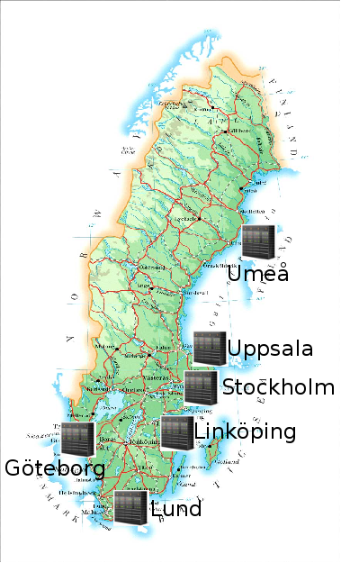

---?image=img/first_slide.png

@snap[north-west]
<h2>Introduction to PDC environment</h2>
<b>Author:</b> Henric Zazzi, PDC Center for High Performance Computing
@snapend

---

## Overview

- General information about PDC
- Infrastructure at PDC
- How to apply to PDC resources
- How to login
- File systems, permissions and transfer
- Modules
- Available software
- How to run jobs
- Compilers
- Conclusion

---

## General information about PDC

---

snap[north-west]
*SNIC Centra*
@snapend

@snap[south-west span-45]
The Swedish National Infrastructure for Computing (SNIC) is a
national research infrastructure that provides a balanced and
cost-efficient set of resources and user support for large scale
computation and data storage to meet the needs of researchers from all
scientific disciplines and from all over Sweden (universities, university
colleges, research institutes, etc). The resources are made available
through open application procedures such that the best Swedish research is supported.
@snapend
@snap[south-east text-left span-45]

@snapend

---

## PDC Offers


---

## PDC Key Assets: First-Line Support and System Staff

@color[green](**First-line support**)

Helps you have a smooth start to using PDC’s resources and provides assistance if
you need help while using our facilities

@color[green](**System staff: System managers/administrators**)

Ensure that PDC’s HPC and storage facilities run smoothly and securely

---

## PDC's Key Assets: HPC Application Experts

@snap[north text-12]
PDC-HPC application experts hold PhD degrees in different scientific fields and are experts in HPC. 
Together with researchers, they optimize, scale and enhance scientific codes for the next generation
supercomputers.
@snapend

@snap[east span-33 text-12]


Molecular Dynamics
@snapend
@snap[span-33 text12]


Bioinformatics/Molecular biology
@snapend
@snap[west span-33 text-12]


Computational Fluid Dynamics
@snapend
@snap[south-east span-33 text-12]


Multiscale Modelling
@snapend
@snap[south span-33 text-12]


Code Optimization
@snapend
@snap[south-west span-33 text-12]


Machine Learning/Performance Analysis
@snapend

---

## Research areas at PDC


**Usage of Beskow by research areas, March 2017**

---

## Infrastructure at PDC

---

## Beskow

- 32nd place on the top500 (Q4 2015)
- Fastest in Scandinavia
- Intended for very large jobs (>512 core/job)
- Allocated through SNIC
- Queue limit is 24 hours
- Runs the SLURM queue system
- Partially reserved for PRACE, SCANIA, INCF
- Lifetime: Q4 2020
  
---  
  
## Tegner

- Intended for Beskow pre/post processing
- Not allocated via SNIC
- Only for academia within the Stockholm area
- Has large RAM nodes
- Has nodes with GPUs
- Runs the SLURM queue system
- Lifetime: Q4 2020  

---

## Summary of PDC resources

Computer | Beskow | Tegner
-------- | ------ | ------
Core/node | 32/36 | 48/24
Nodes | 2060 | **50**: 24 Haswell/GPU
... |  | **10**: 48 Ivy bridge
RAM (Gb) | 64 | **50**: 512
... |  | **5**: 1000
... |  | **5**: 2000
Small allocations | 5000 |  
Medium allocations | 200000 | 50000 
Large allocations | >200000 | 
Allocations via SNIC | yes | no 
Lifetime | Q4 2020 | Q4 2020
AFS | login node only | yes
Lustre | yes | yes

---

## How to apply for PDC resources

---

## Access to PDC resources

- User account (SUPR/PDC)
- Time allocation
  - A measure for how many jobs you can run per month (corehours/month)
  - Which clusters you can access
- Time allocation requirements
  - Can be personal or shared within a project
  - Every user must belong to at least one time allocation

---

## How to get a time allocation

- PDC resources are free for swedish academia
- You can apply for a SUPR account at
  http://supr.snic.se
- In SUPR send in a proposal for your project
- More information at
  http://www.snic.se/allocations/apply4access/

---

## How to login

---

## Kerberos

Is an authentication protocol originally developed at MIT
PDC uses kerberos together with **SSH** for login

@color[green](Ticket)
- Proof of users identity
- Users use password to obtain tickets
- Tickets are cached on users computer for a specified duration
- @color[red](Tickets should be created on your local computer)
- No need to enter password as long as tickets are valid

---

- @color[green](Realm)
  - all resources available to access
  - example: NADA.KTH.SE
- @color[green](Principal)
  - Unique identity to which kerberos can assign tickets. 
  - example: <username>@NADA.KTH.SE

---

## Kerberos commands

Command | Scope
------- | -----
kinit | proves your identity
klist | list your kerberos tickets
kdestroy | destroy your kerberos ticket file
kpasswd | change your kerberos password

```
$ kinit -f <username>@NADA.KTH.SE
$ klist -T

Credentials cache : FILE:/tmp/krb5cc_500
       Principal: <username>@NADA.KTH.SE
Issued       Expires     Flags  Principal
Mar 25 09:45 Mar 25 19:45 FI krbtgt/NADA.KTH.SE@NADA.KTH.SE
Mar 25 09:45 Mar 25 19:45 FA afs/pdc.kth.se@NADA.KTH.SE
```

---

## Login using kerberos tickets

1. Get a 7 days forwardable ticket on your local system
   ```
   $ kinit -f -l 7d <username>@NADA.KTH.SE
   ```
2. Forward your ticket via ssh and login
   ```
   $ ssh <username>@<cluster>.pdc.kth.se
   ```
   beskow login node: beskow.pdc.kth.se
4. You will have reached the cluster

   @color[red](Always create a kerberos ticket on your local system)

---

## Login from any computer


- You can reach PDC from any computer or network
- The kerberos implementation heimdal can be installed on most operating systems
  - Linux *heimdal, openssh-client*
  - Windows *Network Identity Manager, PuTTY*
  - Mac
  - KTH Computers
  
https://www.pdc.kth.se/support/documents/login/login.html

---

## KTH Computers

The same commands, aka *kinit* *klist* *ssh*, kan be used
on KTH computers but must be preceeded by **pdc-**

```
# Get a ticket
$ pdc-kinit -f -l 7d <username>@NADA.KTH.SE
# Login into cluster  
$ pdc-ssh <cluster>.pdc.kth.se
```

More information at
https://www.pdc.kth.se/support/documents/login/kth_ubuntu_login.html

---

More information at
https://www.pdc.kth.se/support/documents/login/kth_ubuntu_login.html

---

## File systems, permissions and transfer

---

## File systems at PDC

- AFS *Andrew File System*
  - distributed
  - global
  - backup
- Lustre *Linux cluster file system*
  - distributed
  - high-performance
  - no backup
  
---

## AFS

- Andrew File System
- Named after the Andrew Project (Carnegie Mellon University)
- Distributed file system
- Security and scalability
- Accessible "everywhere" (remember that when you make your files
  readable/writeable!)
- Not available on Beskow compute nodes
- Access via Kerberos tickets and AFS tokens

---

- Your PDC home directory is located in AFS, example:
  ```
  /afs/pdc.kth.se/home/u/user
  ```  
- OldFiles mountpoint (created by default) contains a snapshot of the files
  as they were precisely before the last nightly backup was taken.
  ```
  /afs/pdc.kth.se/home/u/user/OldFiles
  ```
- By default you get a limited quota (5 GB)

---

## Lustre

- Parallel distributed file system
- Large-scale cluster computing
- High-performance
  ```
  /cfs/klemming
  ```
- UNIX permissions
- No personal quota. @color[red](Move your data when finished)
- Not global

---

- Always start and run your programs in lustre if possible
- Default home directory:
  ```
  # Not backed up
  /cfs/klemming/nobackup/[username 1st letter]/[username]
  # Files older than 30 days will be deleted
  /cfs/klemming/scratch/[username 1st letter]/[username]
  ```

---

## File transfer between PDC machines

- /afs is mounted and visible on all machines (at least on login node)
- No need to "transfer" files which are on /afs
- You can share files between machines via /afs

---

## How to install AFS

Install AFS client and copy directly
then AFS is mounted just like another disk on your computer

https://www.pdc.kth.se/support/documents/managing_files/file_transfer_afs.html
   
---

## scp, an alternative for AFS

```
# from my laptop to Beskow
$ scp myfile <username>@beskow.pdc.kth.se:~/Private
# from Beskow Lustre to my laptop
$ scp <username>@beskow.pdc.kth.se:/cfs/klemming/scratch/<u>/<username>/file.txt .
```

For large files use the transfer nodes on Tegner

@color[green](t04n27.pdc.kth.se, t04n28.pdc.kth.se)
  
```
# from my laptop to klemming  
$ scp file.txt user@t04n27.pdc.kth.se:/cfs/klemming/scratch/<u>/<username>
```

---

## Modules

---

## What are Modules

Used to load a specific software, and versions, into your environment

---

## What modules do

```
$ module show fftw/3.3.4.0
-------------------------------------------------------------------
/opt/cray/modulefiles/fftw/3.3.4.0:

setenv		 FFTW_VERSION 3.3.4.0 
setenv		 CRAY_FFTW_VERSION 3.3.4.0 
setenv		 FFTW_DIR /opt/fftw/3.3.4.0/haswell/lib 
setenv		 FFTW_INC /opt/fftw/3.3.4.0/haswell/include 
prepend-path	 PATH /opt/fftw/3.3.4.0/haswell/bin 
prepend-path	 MANPATH /opt/fftw/3.3.4.0/share/man 
prepend-path	 CRAY_LD_LIBRARY_PATH /opt/fftw/3.3.4.0/haswell/lib 
setenv		 PE_FFTW_REQUIRED_PRODUCTS PE_MPICH 
prepend-path	 PE_PKGCONFIG_PRODUCTS PE_FFTW 
setenv		 PE_FFTW_TARGET_interlagos interlagos 
setenv		 PE_FFTW_TARGET_sandybridge sandybridge 
setenv		 PE_FFTW_TARGET_x86_64 x86_64 
setenv		 PE_FFTW_TARGET_haswell haswell 
setenv		 PE_FFTW_VOLATILE_PKGCONFIG_PATH /opt/fftw/3.3.4.0/@PE_FFTW_TARGET@/lib/pkgconfig 
prepend-path	 PE_PKGCONFIG_LIBS fftw3f_mpi:fftw3f_threads:fftw3f:fftw3_mpi:fftw3_threads:fftw3 
module-whatis	 FFTW 3.3.4.0 - Fastest Fourier Transform in the West 
-------------------------------------------------------------------
```

---

## Module commands

Command | Scope
------- | -----
module add *software[/version]* | loads *software[/version]*
module avail | Lists available softwares
module show *software* | shows information about *software*
module list | Lists currently loaded softwares
module swap *frommodule* *tomodule* | swaps *frommodule* to *tomodule*

---

## Available software

On our cluster, we have already installed a number of software with
their different versions.

More information about the software, how they were installed and how to run them at PDC is available at
https://www.pdc.kth.se/software
   
---

## How to run jobs

---

## SLURM queue system

1. Allocates exclusive access to resources (computer nodes) to users for some duration of time.
2. Provides a framework for starting, executing, and monitoring work on a set of allocated nodes.
3. Arbitrates contention for resources by managing a queue of pending work
4. Installed on Beskow, Tegner
5. Installed by default, no need to load module

---

## Which time allocation am I a member of

Projinfo

```
$ projinfo -h
Usage: projinfo [-u <username>] [-c <clustername>] [-a] [-o]
-u [user] : print information about specific user
-o : print information about all (old) projects, not just current
-c [cluster] : only print allocations on specific cluster
-a : Only print membership in projects
-d : Usage by all project members
-p [DNR] : only print information about this project
-h : prints this help
```

Statistics are also available at...
https://www-local.pdc.kth.se/software/cluster_usage/
   
---

## Course Allocation


Allocation

@color[green](edu19.bioexcel)

---

## Using salloc

- To run interactively (reservation is optional)
  ```   
  $ salloc -A <allocation> -t <min> [--reservation=<reservation>]
  $ mpirun -A <allocation> -n <cores> [-N <nodes] ./MyPrgm
  $ mpirun -A <allocation> -n <cores> [-N <nodes] ./MyPrgm
  $ exit
  ```

- To login into reserved node after salloc
  ```
  $ echo $SLURM_NODELIST
  # From your local computer
  $ ssh <nodename>.pdc.kth.se
  ```

- To book and execute on a dedicated node
  ```
  $ salloc -t <min> -N <nodes> -A <allocation> mpirun -n cores ./MyPrgm
  ```

---

## Requesting a specific type of node

It is also possible in SLURM to request a specific type of node
```
# Request a node with at least 1 TB RAM
salloc -t 1:00:00  -A <allocation> -N 1 --mem=1000000
# Request a node with at least 24 logical CPUs
salloc  -A <allocation> -N 1 -t 300 --mincpus=24
# Request a node with a K80 GPU
salloc  -A <allocation> --gres=gpu:K80:2
```
  
If the cluster does not have enough nodes of that type then the request will fail with an error message.

---

## Using sbatch

```
$ sbatch <script>
```

```
#!/bin/bash -l
#SBATCH -J myjob
# Defined the time allocation you use
#SBATCH -A <allocation>
# 10 minute  wall-clock time will be given to this job
#SBATCH -t 10:00
# Number of nodes
#SBATCH --nodes=2
# set tasks per node to 24 to disable hyperthreading
#SBATCH --ntasks-per-node=24
# load intel compiler and mpi
module load i-compilers intelmpi
# Run program 
mpirun -n 48 ./hello_mpi
```

---

## Other SLURM commands

- To remove a submitted job
  ```
  $ scancel jobid
  ```

* Show my running jobs
  ```
  $ squeue [-u <username>]
  ```

---

## Compilers

---

## Compilers and libraries on Beskow

- PrgEnv-cray, PrgEnv-Intel (Intel), PrgEnv-gnu (GNU)
  - By default **PrgEnv-cray** is loaded
  - Swap it by using command...
    ```
    $ module swap PrgEnv-cray PrgEnv-other
    ```
- Always use the wrappers for compiling

  - cc (C code), CC (C++), ftn (FORTRAN)
      
---
   
- Wrappers automatically link with math libraries if their modules are loaded
  ```
  $ module load cray-libsci fftw
  ```
  - Other libraries are lapack, blas scalapack, blacs,...
  -  https://www.pdc.kth.se/software/#libraries

---

## Using compiler wrappers on Beskow (serial and MPI)

```
# Fortran
ftn [flags] source.f90
# C
cc [flags] source.c
# C++
CC [flags] source.cpp
```

---

## Compiling OpenMP code on a Beskow

```
# Intel
ftn -openmp source.f90
cc -openmp source.c
CC -openmp source.cpp
# Cray
ftn -h omp source.f90
cc -h omp source.c
CC -h omp source.cpp
# GNU
ftn -fopenmp source.f90
cc -fopenmp source.c
CC -fopenmp source.cpp
```

---

## Compiling serial code on Tegner

```
# GNU
$ gfortran -o hello hello.f
$ gcc -o hello hello.c
$ g++ -o hello hello.cpp
# Intel
$ module add i-compilers
$ ifort -FR -o hello hello.f
$ icc -o hello hello.c
$ icpc -o hello hello.cpp
```

---

Compiling MPI/OpenMP code on Tegner
-----------------------------------

```
# GNU
$ module add gcc/5.1 openmpi/1.8-gcc-5.1 
$ mpif90 -FR -fopenmp -o hello_mpi hello_mpi.f
$ mpicc -fopenmp -o hello_mpi hello_mpi.c
$ mpic++ -fopenmp -o hello_mpi hello_mpi.cpp
# Intel
$ module add i-compilers intelmpi
$ mpiifort -openmp -o hello.f90 -o hello_mpi
$ mpiicc -openmp -o hello_mpi hello_mpi.c
$ mpiicpc  -openmp -o hello_mpi hello_mpi.cpp
```

---

## Conclusion

---

## PDC support


- A lot of question can be answered via our web
  http://www.pdc.kth.se/support
-  The best way to contact us is via e-mail
   https://www.pdc.kth.se/support/documents/contact/contact_support.html
- The support request will be tracked
- Use a descriptive subject in your email
- Give your PDC user name.
- Provide all necessary information to reproduce the problem.
- For follow ups always reply to our emails

---

This presentation is available at 
https://gitpitch.com/PDC-support/introduction-to-pdc/course-gitpitch
